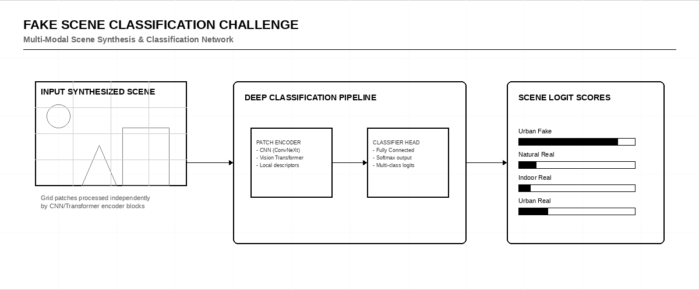
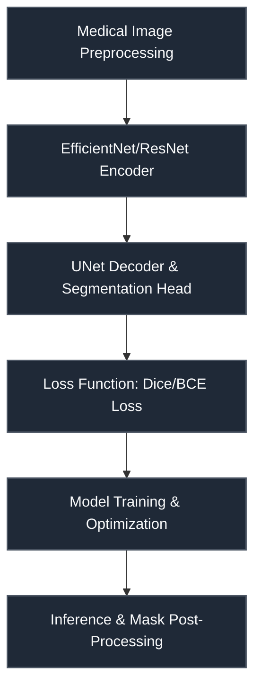

# Fake Scene Classification Challenge

 

> **Host:** [`Kaggle Community`]  
> **Platform Link:** [Kaggle Competition](https://www.kaggle.com/competitions/fake-scene-classification)  
> **Dataset Link:** [Kaggle Dataset](https://www.kaggle.com/competitions/fake-scene-classification/data)  
> **Domain:** `Computer Vision & Media Forensics`

## Overview

This repository contains the developmental workspace and notebooks for the **Fake Scene Classification Challenge** project. The primary focus of this project is in the domain of **Computer Vision & Media Forensics** on Kaggle Community. The codebase represents an iterative implementation of machine learning pipelines, structured to process datasets, train models, and validate predictions.

### Technical Methodology & Implementation

The codebase features a total of 740 cells across 97 notebook(s). The system implements several key architectural elements:
- **Core Classes**: Custom object-oriented structures are defined to manage state and logic, including: `ConvBlock`, `EfficientNet`, `EffnetModel`, `FSC`, `MBBlock`, `SqueezeExcitation`.
- **Key Algorithms & Utilities**: Procedural helpers and utilities facilitate operations, notably: `LoG_filter`, `__init__`, `create_dataset`, `create_model`, `feature_extractor`, `forward`, `weights_init`.
- **Training & Optimization**: Includes optimization via Adam.

## System Architecture

## Notebook Architecture

### Preprocessing & EDA

| Notebook / Script | Type | Versions | Average Size | Core Stack / Techniques |
| :--- | :--- | :--- | :--- | :--- |
| [Preprocessing](./Preprocessing%20%26%20EDA/Preprocessing.ipynb) | Single Notebook | v1 | 4 KB | OpenCV |
| [Preprocessing_2](./Preprocessing%20%26%20EDA/Preprocessing_2.ipynb) | Single Notebook | v1 | 3 KB | OpenCV |
| **Preprocessing_3** | Multi-Version Script | [v1](./Preprocessing%20%26%20EDA/Preprocessing_3/v1.ipynb), [v2](./Preprocessing%20%26%20EDA/Preprocessing_3/v2.ipynb), [v3](./Preprocessing%20%26%20EDA/Preprocessing_3/v3.ipynb), [v4](./Preprocessing%20%26%20EDA/Preprocessing_3/v4.ipynb), [v5](./Preprocessing%20%26%20EDA/Preprocessing_3/v5.ipynb) | 3 KB | OpenCV |
| **Preprocessing_4** | Multi-Version Script | [v1](./Preprocessing%20%26%20EDA/Preprocessing_4/v1.ipynb), [v2](./Preprocessing%20%26%20EDA/Preprocessing_4/v2.ipynb), [v3](./Preprocessing%20%26%20EDA/Preprocessing_4/v3.ipynb), [v4](./Preprocessing%20%26%20EDA/Preprocessing_4/v4.ipynb), [v5](./Preprocessing%20%26%20EDA/Preprocessing_4/v5.ipynb), [v6](./Preprocessing%20%26%20EDA/Preprocessing_4/v6.ipynb) | 4 KB | OpenCV |

### Inference & Submission

| Notebook / Script | Type | Versions | Average Size | Core Stack / Techniques |
| :--- | :--- | :--- | :--- | :--- |
| **EfficientNet_CNN_Inference** | Multi-Version Script | [v1](./Inference%20%26%20Submission/EfficientNet_CNN_Inference/v1.ipynb), [v2](./Inference%20%26%20Submission/EfficientNet_CNN_Inference/v2.ipynb), [v3](./Inference%20%26%20Submission/EfficientNet_CNN_Inference/v3.ipynb), [v4](./Inference%20%26%20Submission/EfficientNet_CNN_Inference/v4.ipynb), [v5](./Inference%20%26%20Submission/EfficientNet_CNN_Inference/v5.ipynb), [v6](./Inference%20%26%20Submission/EfficientNet_CNN_Inference/v6.ipynb), [v7](./Inference%20%26%20Submission/EfficientNet_CNN_Inference/v7.ipynb), [v8](./Inference%20%26%20Submission/EfficientNet_CNN_Inference/v8.ipynb), [v9](./Inference%20%26%20Submission/EfficientNet_CNN_Inference/v9.ipynb), [v10](./Inference%20%26%20Submission/EfficientNet_CNN_Inference/v10.ipynb), [v11](./Inference%20%26%20Submission/EfficientNet_CNN_Inference/v11.ipynb), [v12](./Inference%20%26%20Submission/EfficientNet_CNN_Inference/v12.ipynb), [v13](./Inference%20%26%20Submission/EfficientNet_CNN_Inference/v13.ipynb), [v14](./Inference%20%26%20Submission/EfficientNet_CNN_Inference/v14.ipynb), [v15](./Inference%20%26%20Submission/EfficientNet_CNN_Inference/v15.ipynb), [v16](./Inference%20%26%20Submission/EfficientNet_CNN_Inference/v16.ipynb), [v17](./Inference%20%26%20Submission/EfficientNet_CNN_Inference/v17.ipynb) | 16 KB | OpenCV, PyTorch |
| **EfficientNet_Inference** | Multi-Version Script | [v25](./Inference%20%26%20Submission/EfficientNet_Inference/v25.ipynb), [v26](./Inference%20%26%20Submission/EfficientNet_Inference/v26.ipynb), [v27](./Inference%20%26%20Submission/EfficientNet_Inference/v27.ipynb), [v28](./Inference%20%26%20Submission/EfficientNet_Inference/v28.ipynb), [v29](./Inference%20%26%20Submission/EfficientNet_Inference/v29.ipynb), [v30](./Inference%20%26%20Submission/EfficientNet_Inference/v30.ipynb), [v31](./Inference%20%26%20Submission/EfficientNet_Inference/v31.ipynb), [v32](./Inference%20%26%20Submission/EfficientNet_Inference/v32.ipynb), [v33](./Inference%20%26%20Submission/EfficientNet_Inference/v33.ipynb), [v34](./Inference%20%26%20Submission/EfficientNet_Inference/v34.ipynb), [v35](./Inference%20%26%20Submission/EfficientNet_Inference/v35.ipynb), [v36](./Inference%20%26%20Submission/EfficientNet_Inference/v36.ipynb), [v37](./Inference%20%26%20Submission/EfficientNet_Inference/v37.ipynb), [v38](./Inference%20%26%20Submission/EfficientNet_Inference/v38.ipynb), [v39](./Inference%20%26%20Submission/EfficientNet_Inference/v39.ipynb), [v40](./Inference%20%26%20Submission/EfficientNet_Inference/v40.ipynb), [v41](./Inference%20%26%20Submission/EfficientNet_Inference/v41.ipynb), [v42](./Inference%20%26%20Submission/EfficientNet_Inference/v42.ipynb), [v43](./Inference%20%26%20Submission/EfficientNet_Inference/v43.ipynb), [v44](./Inference%20%26%20Submission/EfficientNet_Inference/v44.ipynb), [v45](./Inference%20%26%20Submission/EfficientNet_Inference/v45.ipynb), [v46](./Inference%20%26%20Submission/EfficientNet_Inference/v46.ipynb), [v47](./Inference%20%26%20Submission/EfficientNet_Inference/v47.ipynb), [v48](./Inference%20%26%20Submission/EfficientNet_Inference/v48.ipynb), [v49](./Inference%20%26%20Submission/EfficientNet_Inference/v49.ipynb), [v50](./Inference%20%26%20Submission/EfficientNet_Inference/v50.ipynb), [v51](./Inference%20%26%20Submission/EfficientNet_Inference/v51.ipynb), [v52](./Inference%20%26%20Submission/EfficientNet_Inference/v52.ipynb), [v53](./Inference%20%26%20Submission/EfficientNet_Inference/v53.ipynb), [v54](./Inference%20%26%20Submission/EfficientNet_Inference/v54.ipynb), [v55](./Inference%20%26%20Submission/EfficientNet_Inference/v55.ipynb), [v56](./Inference%20%26%20Submission/EfficientNet_Inference/v56.ipynb), [v57](./Inference%20%26%20Submission/EfficientNet_Inference/v57.ipynb), [v58](./Inference%20%26%20Submission/EfficientNet_Inference/v58.ipynb), [v59](./Inference%20%26%20Submission/EfficientNet_Inference/v59.ipynb), [v60](./Inference%20%26%20Submission/EfficientNet_Inference/v60.ipynb), [v61](./Inference%20%26%20Submission/EfficientNet_Inference/v61.ipynb), [v62](./Inference%20%26%20Submission/EfficientNet_Inference/v62.ipynb), [v63](./Inference%20%26%20Submission/EfficientNet_Inference/v63.ipynb), [v64](./Inference%20%26%20Submission/EfficientNet_Inference/v64.ipynb), [v65](./Inference%20%26%20Submission/EfficientNet_Inference/v65.ipynb), [v66](./Inference%20%26%20Submission/EfficientNet_Inference/v66.ipynb), [v67](./Inference%20%26%20Submission/EfficientNet_Inference/v67.ipynb), [v68](./Inference%20%26%20Submission/EfficientNet_Inference/v68.ipynb), [v69](./Inference%20%26%20Submission/EfficientNet_Inference/v69.ipynb), [v70](./Inference%20%26%20Submission/EfficientNet_Inference/v70.ipynb), [v71](./Inference%20%26%20Submission/EfficientNet_Inference/v71.ipynb), [v72](./Inference%20%26%20Submission/EfficientNet_Inference/v72.ipynb), [v73](./Inference%20%26%20Submission/EfficientNet_Inference/v73.ipynb), [v74](./Inference%20%26%20Submission/EfficientNet_Inference/v74.ipynb), [v75](./Inference%20%26%20Submission/EfficientNet_Inference/v75.ipynb), [v76](./Inference%20%26%20Submission/EfficientNet_Inference/v76.ipynb), [v77](./Inference%20%26%20Submission/EfficientNet_Inference/v77.ipynb), [v78](./Inference%20%26%20Submission/EfficientNet_Inference/v78.ipynb), [v79](./Inference%20%26%20Submission/EfficientNet_Inference/v79.ipynb), [v80](./Inference%20%26%20Submission/EfficientNet_Inference/v80.ipynb), [v81](./Inference%20%26%20Submission/EfficientNet_Inference/v81.ipynb), [v82](./Inference%20%26%20Submission/EfficientNet_Inference/v82.ipynb), [v83](./Inference%20%26%20Submission/EfficientNet_Inference/v83.ipynb), [v84](./Inference%20%26%20Submission/EfficientNet_Inference/v84.ipynb), [v85](./Inference%20%26%20Submission/EfficientNet_Inference/v85.ipynb), [v86](./Inference%20%26%20Submission/EfficientNet_Inference/v86.ipynb), [v87](./Inference%20%26%20Submission/EfficientNet_Inference/v87.ipynb), [v88](./Inference%20%26%20Submission/EfficientNet_Inference/v88.ipynb), [v89](./Inference%20%26%20Submission/EfficientNet_Inference/v89.ipynb), [v90](./Inference%20%26%20Submission/EfficientNet_Inference/v90.ipynb) | 25 KB | OpenCV, PyTorch, Scikit-Learn |
| [Inference](./Inference%20%26%20Submission/Inference.ipynb) | Single Notebook | v1 | 159 KB | OpenCV, TensorFlow/Keras |

## Navigation Guidelines

> **Stage Guidelines**
>
- **EDA & Preprocessing**: Verify data loaders and inspect class distributions before model design.
- **Training & Validation**: Check training runs, loss curves, and model validation scores to evaluate performance.
- **Inference & Ensembling**: Run predictions on testing files and verify submission formatting.

---

> "We build perfect simulations, until the real and the fake merge into one dark dream."
>
> — **Vigneshwaran S**
